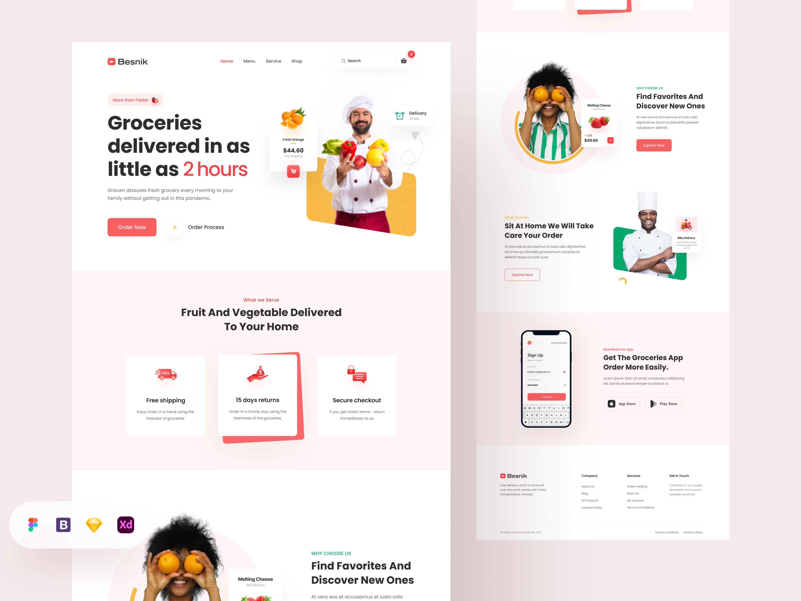

# Food-Delivery-Website

### You can cheek out [HEAR](https://hassan-jaber.github.io/Food-Delivery-Website/)

### You can download figma and xd [HEAR](https://uihut.com/web-designs/grover-grocery-food-delivery-website/10940)

## Technical languages
   

## This project has been developed depends on :

* Using a good page layout
* Using semantic HTML
* Responsive design